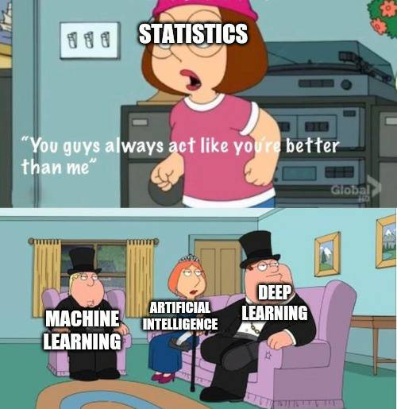

> # Artificial Intelligence
>
> ## Image 1
>  `https://chappatte.com/sites/default/files/styles/thumb/public/2023-05/L230503ce-small.jpg?itok=6Yj04ccZ`
> 16.04.2024:
>
> ### Image Description:
> > A Roboter with an A.I. Tshirt has a Headset on his head and says "Human Resources Department, How may I help You?
>
> ### My Observation:
> > "The robot in the image is wearing an 'A.I.' t-shirt, indicating that it is an artificial intelligence system. The fact that it is working in a human resources department suggests that AI is being **used to perform tasks traditionally done by humans**".
>
> ## Vocabulary
>
> - Artificial Intelligence (AI)
>   > Computer systems designed to perform tasks that normally require human intelligence.
> - Human Resources (HR)
>   > The department in a company responsible for hiring, training, and managing employees.
> - Task
>   > A piece of work to be done or undertaken.
> - Traditionally
>   > In a way that is part of the history or customs of a particular group of people.
>
> ---
>
> ## Image 2
> > `https://www.codeitbro.com/wp-content/uploads/2022/07/funniest-memes-on-ai.jpeg`
> > 16.04.2024
>
> ### Image Description:
> > The meme features Meg from Family Guy in the top panel, with a text box that reads "Statistics". She is saying "You guys always act like you're better than me". In the bottom panel, three other characters from the show are labeled as "Machine Learning", "Artificial Intelligence", and "Deep Learning". Chris, with a cylinder on his head, represents Machine Learning. Louise, looking grumpy, represents Artificial Intelligence. Peter, also with a cylinder on his head, represents Deep Learning.
>
> ### Analysis:
> > This meme is a humorous take on the relationship between different fields of artificial intelligence. The character of Meg, representing Statistics, is portrayed as feeling overlooked and undervalued compared to the other fields. This could be a commentary on how statistics, while fundamental to these fields, is sometimes overlooked in favor of more "advanced" techniques. The characters chosen to represent Machine Learning, Artificial Intelligence, and Deep Learning might reflect stereotypes or common perceptions about these fields. For example, Louise's grumpy expression might suggest that Artificial Intelligence is often seen as complex and difficult to understand.
>
> ## Vocabulary
>
> - Statistics
>   > The practice or science of collecting and analyzing numerical data in large quantities.
> - Machine Learning
>   > A subset of AI that uses statistical techniques to give computers the ability to learn from data, without being explicitly programmed.
> - Deep Learning
>   > A subset of machine learning in AI that has networks capable of learning unsupervised from data that is unstructured or unlabeled.
> - Overlooked
>   > Fail to notice or consider.
> - Stereotype
>   > A widely held but fixed and oversimplified image or idea of a particular type of person or thing.