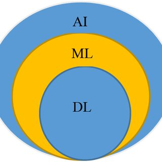

### Table of Contents

|  Slide | content                  |
|  ---- | -------------------------|
|  3    | Introduction             |
|  4    | What is AI?              | 
|  5    | Misconceptions about AI  |
|  6    | What is Machine Learning?| 
|  7    | Types of AI              | 
|  10   | History of AI            |
---
# Artificial Intelligence
## AI
IKA 9/22 Vito Skolan
09.02.2024
This presentation was made using [markdown](https://www.markdownguide.org/) code and [Marp](https://marp.app/).

---

### What is AI?
- “Ladies and gentlemen, welcome to my presentation on artificial intelligence. Today, we’ll explore the fascinating world of AI, which stands for Artificial Intelligence. So, what exactly is AI? It refers to computer systems that perform tasks requiring human-like intelligence. These systems can automate tasks, analyze data, and even make decisions.”
---
### But what does artificial intelligence realy mean? pt.2

###### John McCarthy's definition 2004 :
“Now, let’s dive deeper into the definition of AI. According to John McCarthy, a computer scientist, AI is the science and engineering of creating intelligent machines, especially intelligent computer programs. It’s related to understanding human intelligence, but AI doesn’t have to limit itself to methods that are biologically observable.”

---
### Misconceptions about AI
“Here’s an interesting point: When most people use the term ‘AI’ today, they’re often referring to machine learning.. And what’s machine learning? Well, it’s a subset of AI that enables machines to learn from data and improve over time. Think of it as teaching computers to recognize speech, identify images, understand natural language, and make decisions.”
- when most people use the term AI today, they’re often referring to machine learning. 
  - Machine Learning: 
    - enables machines to perform tasks *previously exclusive* to humans:
      - recognizing speech
      - identifying images
      - understanding natural language
      - making decisions
---

### What is Machine Learning?
- ML= Machine Learning. 
  - It is a subset of AI that enables machines to learn from data and improve over time.
  
    - Venn Diagram: _ 

--- 

### Types of AI
- **Realized AI**
- **Theoretical AI**
---

### Types of AI
- **Realized AI**   
  - **Narrow AI**: 
    - Specific tasks, needs training from Human input.
  - **Reactive AI**: 
    - Analyzes data for intelligent output.
  - **Limited Memory AI**: 
    - Recalls past events, 
    - improves over time (e.g., ChatGPT).
---
### Types of AI
#### Theoretical AI
- **Artificial General Intelligence**: 
  - Learns without human training. [AGI](https://en.wikipedia.org/wiki/Artificial_general_intelligence)
- **Super AI**: 
  - Hypothetical, beyond human abilities. [Super AI](https://en.wikipedia.org/wiki/Superintelligence)
---

### History of AI
- 1952: 
Arthur Samuel writes the first computer learning application.
- 1956: 
The Word "Artificial intelligence" got coined by John McCarthy.
- 1969: 
"Shakey" was the first General purpose mobile robot built
- 1997: 
Supercomputer "Deep Blue" was designed by IBM. it defeated the word chess champion in a game.
---

### History of AI
- 2002: 
  First commercially successful robotic vacuum cleaner created (Roomba).
- 2019: 
  OpenAI releases the GPT-2 language model.
- 2020:
  Waymo launches Waymo One, a fully autonomous taxi service in the Phoenix area, marking a significant milestone in self driving car technology.
---
### History of AI
- 2022: 
  Open AI debuts ChatGPT, an AI chatbot build on GPT 3.5
- 2023: 
  The leaked LLaMA AI Language model
---

### AI in the Future
## AI is expected to...
- have a significant impact on the future of work, healthcare, and transportation.
- create new jobs and industries, but it may also lead to job displacement and economic inequality.
- continue to improve and become more integrated into our daily lives.
- raise ethical and social issues that will need to be addressed.
---

### References
- [Wikipedia](https://en.wikipedia.org/wiki/Artificial_intelligence)
- [IBM](https://www.ibm.com/cloud/learn/what-is-artificial-intelligence)
- [OpenAI](https://openai.com/)

---

###### thank you for your attention! :)